# Sistema RAG para Análisis de Documentos

Este proyecto implementa un sistema de Retrieval-Augmented Generation (RAG) para procesar y consultar documentos en español, utilizando un modelo de lenguaje local (Mistral 7B) y una base de datos vectorial (Qdrant).

## Características

- Procesamiento de documentos PDF y Markdown
- División de documentos en chunks con superposición
- Generación de embeddings utilizando sentence-transformers
- Almacenamiento vectorial con Qdrant
- Recuperación de documentos relevantes basada en similitud semántica
- Generación de respuestas en español con referencias a documentos
- Soporte para filtrado por región y comuna

## Estructura del Proyecto
    ├── src/
    │ ├── ingestion_agent.py # Maneja la ingesta de documentos
    │ ├── rag_agent.py # Implementa el sistema RAG
    │ ├── vector_store.py # Interfaz con Qdrant
    │ ├── document_processor.py # Procesamiento de documentos
    │ └── config.py # Configuración del sistema
    ├── docs/
    │ ├── unprocessed/ # Documentos sin procesar
    │ └── processed/ # Documentos ya procesados
    ├── model/ # Modelo de lenguaje Mistral 7B
    ├── data/
    │ ├── vector_db/ # Base de datos vectorial Qdrant
    │ └── geographic_data.json # Datos geográficos para filtrado
    └── test_pipeline.py # Script de prueba


# Configuración
    El sistema se configura a través del archivo src/config.py. Las opciones principales incluyen:

    MODEL_PATH: Ruta al modelo de lenguaje Mistral 7B
    DOCS_DIR: Directorio de documentos
    VECTOR_DB_PATH: Ruta a la base de datos vectorial
    CHUNK_SIZE: Tamaño de los fragmentos de texto (por defecto: 1000)
    CHUNK_OVERLAP: Superposición entre fragmentos (por defecto: 200)
    EMBEDDING_MODEL: Modelo de embeddings (por defecto: "sentence-transformers/all-MiniLM-L6-v2")


# Creación del Entorno Virtual
Para crear un entorno virtual con Python 3.10.18 utilizando conda, ejecuta este comando en tu terminal:

```bash 
    conda create --name nombre-entorno python=3.10.18
```

```bash 
    conda activate nombre-entorno
```


# Instalación de Dependencias
``` bash 
pip install -r requirements.txt
```


# Modelo local 

El modelo local puede ser obtenido de: 

https://huggingface.co/TheBloke/Mistral-7B-Instruct-v0.1-GGUF/resolve/main/mistral-7b-instruct-v0.1.Q4_K_M.gguf


# Uso
 Para probrar el demo simple local debes ejecutar el dashboard de estrimlit  en tu entorno activo luego de haber instalado las librerías utilizando:

```bash  
    streamlit run app.py
```

# Diagramas de Flujo






